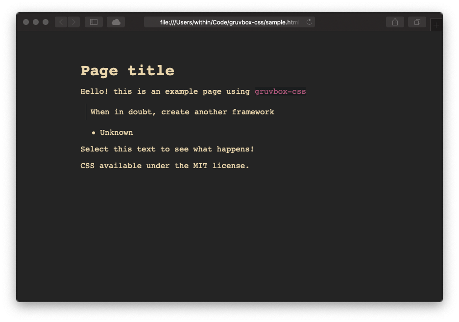
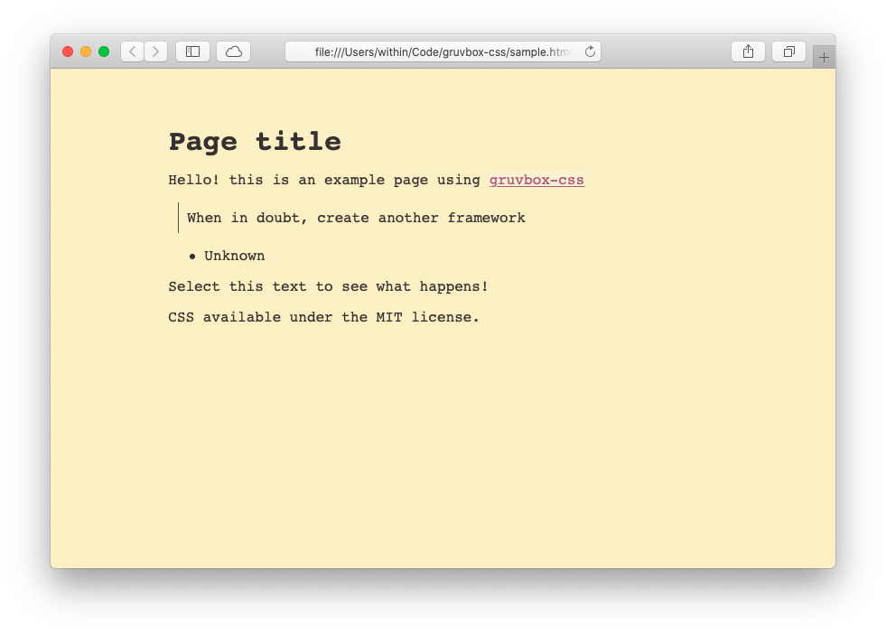

# Xess

This is a CSS file I've been working on for a few years off and on. It is a
simple CSS theme that emulates [Gruvbox][gruvbox] with automatic support for
light mode using the [light mode CSS media query][darklightmode].

It should be pronounced like the word "zest" without the "t" at the end. This is
intended to be a companion to [Xeact](https://github.com/Xe/Xeact)

## HTML Skeleton

``` html
<!DOCTYPE html>
<html>
    <head>
        <title>Page Title</title>
        <link rel="stylesheet" href="/static/xess.css">
        <meta name="viewport" content="width=device-width, initial-scale=1.0" />
    </head>
    <body id="top">
        <main>
            <h1>Page title</h1>

            <p>Hello! this is an example page using <a href="https://github.com/Xe/Xess">Xess</a></p>
            
            <blockquote>When in doubt, create another framework</blockquote>
            
            <ul><li>Unknown</li></ul>
            
            <p>Select this text to see what happens!</p>

            <footer>
                <p>CSS available under the MIT license.</p>
            </footer>
        </main>
    </body>
</html>
```

## Dark Mode



## Light Mode



[gruvbox]: https://www.github.com/morhetz/gruvbox
[darklightmode]: https://css-tricks.com/dark-modes-with-css/

